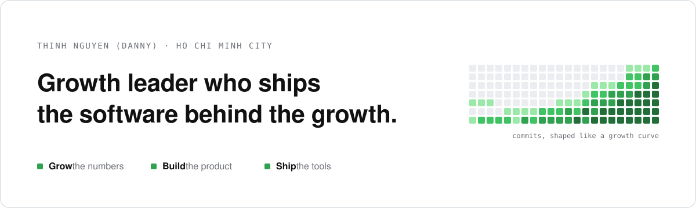

<picture>
  <source media="(prefers-color-scheme: dark)" srcset="assets/banner-dark.svg">
  
</picture>

**Growth Manager at [Nextwaves](https://www.linkedin.com/company/nextwaves-industries/). Founder of [Ordinex](https://ordinex.cc).**
Ten years growing eCommerce, fintech and Web3 businesses in Vietnam and the region.
I own the number, and I build the software that moves it.

[LinkedIn](https://www.linkedin.com/in/quocthinh94/) · [ordinex.cc](https://ordinex.cc) · [thinh.nguyen@ordinex.cc](mailto:thinh.nguyen@ordinex.cc)

<table>
<tr>
<th align="left" width="33%">Grow</th>
<th align="left" width="33%">Build</th>
<th align="left" width="33%">Ship tools</th>
</tr>
<tr valign="top">
<td>

**Fahasa.com** 
Led growth on a $7M/year P&L with 20+ staff, to record revenue.

**Zoomcar Vietnam** 
Built from zero: about 3x search conversion, 60%+ repeat bookings.

**Web3 and fintech** 
Marketing Director for a $500M FDV protocol and a $12M raise.

</td>
<td>

**[Ordinex SellerOps](#ordinex-sellerops)** 
Profit and loss software for TikTok Shop sellers, on the official seller API.

**[ordinex.cc](https://ordinex.cc)** 
Bilingual EN/VI site, run by an automated content pipeline and free seller tools.

**[inbox-ledger](https://github.com/dannybosie/inbox-ledger)** 
A household ledger that fills itself from bank alert emails. Cloudflare, $0 a month.

</td>
<td>

**[breakeven-roas](https://dannybosie.github.io/breakeven-roas/)** 
Break-even ROAS and max CPA for a TikTok Shop order.

**[utm-governor](https://dannybosie.github.io/utm-governor/)** 
Predicts the GA4 channel of every UTM link before launch.

**[slop-lint](https://dannybosie.github.io/slop-lint/)** 
Fails the build on AI tells, in English and Vietnamese.

**[vn-peak-trading-calendar](https://dannybosie.github.io/vn-peak-trading-calendar/)** 
Vietnam sale days and holidays as calendar feeds.

**[TikTok Shop VN fee data](https://github.com/dannybosie/tiktok-shop-vn-commission-rates)** 
1,808 categories diffed. Surfaced 403 fee cuts that went unreported.

</td>
</tr>
</table>

### Ordinex SellerOps

A bootstrapped B2B SaaS for cross-border sellers in Southeast Asia. I run the go-to-market
(positioning, brand, content, SEO, distribution) and I built the product.

- Connects to TikTok Shop's official seller API and TikTok Ads, and syncs on a schedule.
- Profit per order and per SKU, product cost by month, inventory, restock, cashflow, returns and pricing.
- Over 1,000 commits in under six months. Next.js, TypeScript, Postgres, 200+ test files.
- One operator, no engineering team.

### Open source and open data

Each tool below ships with tests, CI and a README that slop-lint checks on every push.

| Repo | What it is | Try it |
|---|---|---|
| [breakeven-roas](https://github.com/dannybosie/breakeven-roas) | **Unit Economics Intelligence.** Break-even ROAS, max CPA and CM1 to CM3 for a TikTok Shop Vietnam order, with commission by category. English and Vietnamese. | [Calculator](https://dannybosie.github.io/breakeven-roas/) |
| [utm-governor](https://github.com/dannybosie/utm-governor) | **Attribution Hygiene Linter.** Predicts the GA4 channel of every UTM link and catches Unassigned, casing drift and internal UTMs. CLI and GitHub Action. | [Builder](https://dannybosie.github.io/utm-governor/) |
| [slop-lint](https://github.com/dannybosie/slop-lint) | **Brand Voice Governance Engine.** Flags AI tells, buzzwords and em dashes in English and Vietnamese copy, with a Jargon Density Score. CLI and GitHub Action. | [Playground](https://dannybosie.github.io/slop-lint/) |
| [vn-peak-trading-calendar](https://github.com/dannybosie/vn-peak-trading-calendar) | **Campaign Seasonality Intelligence.** Vietnam sale days, holidays and gifting dates as subscribable feeds with prep reminders. Lunar dates computed and tested. | [Subscribe](https://dannybosie.github.io/vn-peak-trading-calendar/) |
| [inbox-ledger](https://github.com/dannybosie/inbox-ledger) | **Zero-cost Finance Ops on the edge.** A household ledger that fills itself from bank alert emails. Cloudflare Workers, D1 and Email Routing. | [Template](https://github.com/dannybosie/inbox-ledger#set-it-up) |
| [tiktok-shop-vn-commission-rates](https://github.com/dannybosie/tiktok-shop-vn-commission-rates) | **Marketplace Fee Intelligence.** TikTok Shop Vietnam commission schedules, effective-dated and diffed category by category. CC BY 4.0. | [Fee lookup](https://ordinex.cc/en/tools/tiktok-shop-fees) |

### How I work

AI-native. I run growth with the same tools engineers use, which lets one operator go from
a funnel question to a shipped tool in days. Most of that work lives in private repos, so the
contribution graph below is the honest signal that I am in it every day.

Next.js · TypeScript · Postgres · Prisma · Supabase · Cloudflare Workers · Remotion · GitHub Actions · Claude Code · GA4 · Search Console · Meta and TikTok Ads
